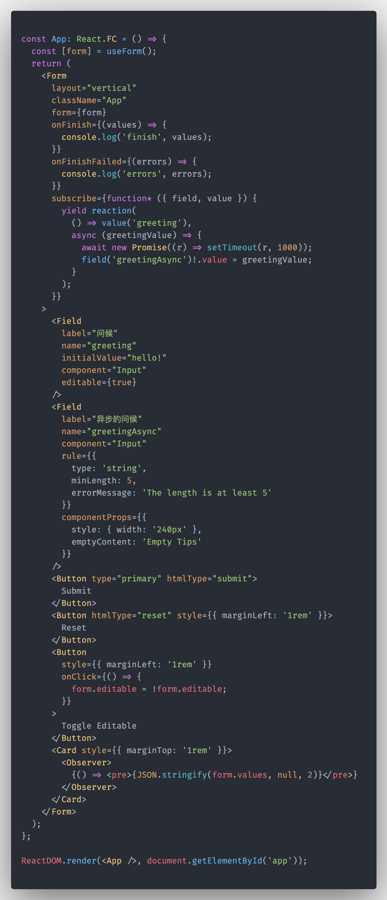

<p align="center">
  
</p>

<h1 align="center">Formular</h1>
<p align="center">
  A Mobx-based form resolution 🐺
</p>

<div align="center">

[](https://lernajs.io/)

</div>




## Features

### Subscription based

拥有直接命令式的编写表单副作用的接口，相比于使用 `Rxjs`，大大降低开发者的心智负担

### Schema based

渲染时拥有一套定义表单的 `DSL`，帮助开发者前后统一表单协议


## Get Started

### install

```bash
$ yarn add mobx mobx-react mobx-state-tree # add dependencies

$ yarn add @formular/react
# or
$ yarn add @formular/antd
```

## License

[MIT License](./LICENSE)
