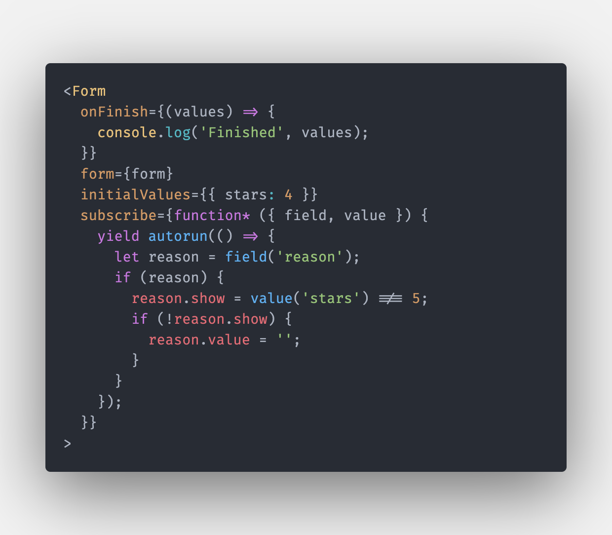
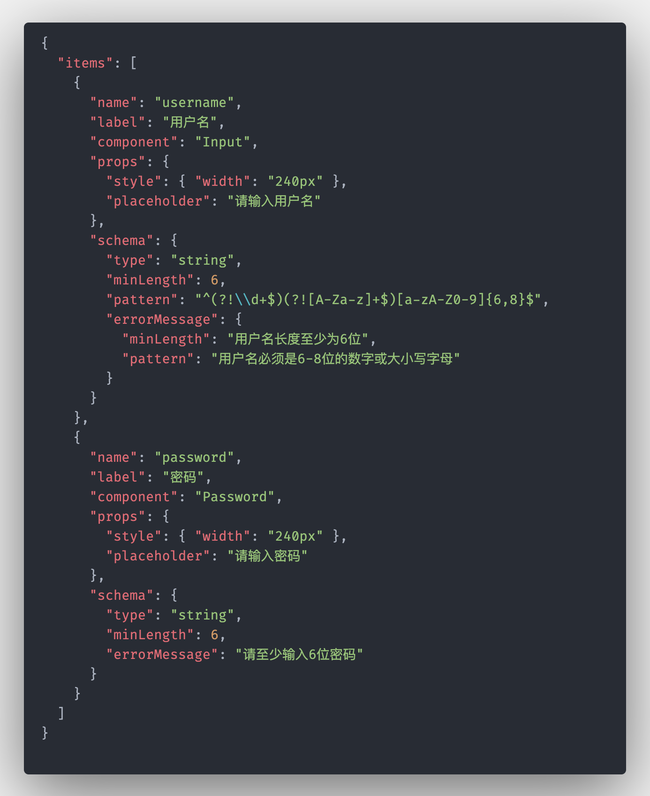
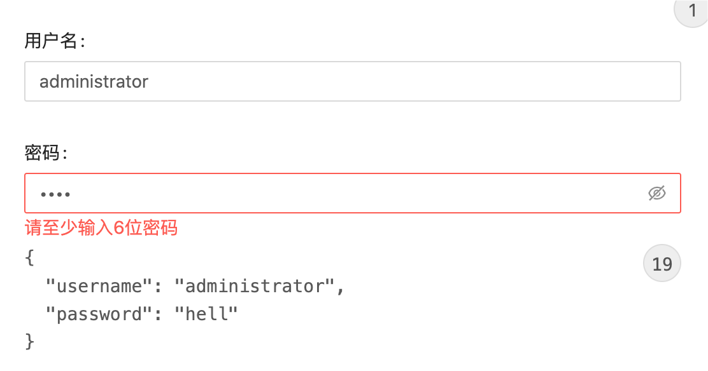

# Formular

> Formular 是一个基于 `Mobx` 的响应-订阅式的通用表单解决方案

<vedio src="./docs/demo.mp4"/>



## Features

### Subscription based

拥有直接命令式的编写表单副作用的接口，相比于使用 `Rxjs`，大大降低开发者的心智负担

### Schema based

渲染时拥有一套定义表单的 `DSL`，帮助开发者前后统一表单协议





## Get Started

### install

```bash
$ yarn add mobx mobx-react mobx-state-tree # add dependencies

$ yarn add @formular/react
# or
$ yarn add @formular/antd
```
